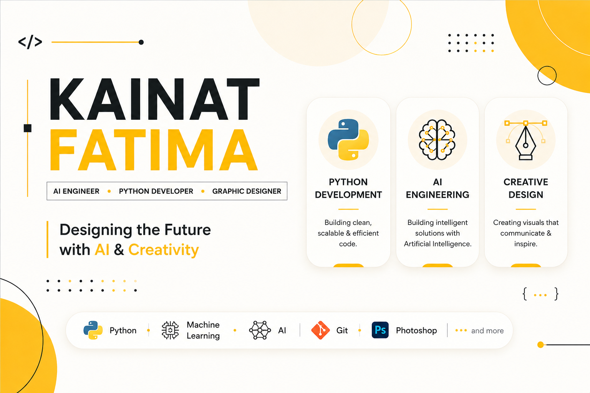

  

## 💛 About Me

I'm passionate about building practical AI solutions while creating meaningful digital experiences through design and development.

- 🤖 Exploring Artificial Intelligence & Machine Learning
- 🐍 Building Python Projects
- 💻 Full Stack Development
- 🎨 Freelance Graphic Designer
- 📚 Sharing Python & AI content

## 🛠 Tech Stack

### AI & Data

- NumPy
- Pandas

### Design

- Adobe Photoshop
- Adobe Illustrator
- Canva
## 🚀 Featured Projects

### 🐍 Python Beginner to Advanced

Complete Python learning repository with beginner-friendly notes, examples, and practice notebooks.

---

### 💻 RIWAYA — MERN E-commerce & ERP

Full-stack MERN application featuring inventory, warehouse, orders, payments, ERP, and admin dashboard.

---

### 🤖 DiabetesAI

Machine Learning application for diabetes prediction using medical data.

---

### 💰 Financial Zen

AI-powered personal finance management platform.

## 📊 GitHub Activity

  

  

## 🌐 Connect With Me

### 💛 Where Creativity Meets Artificial Intelligence

⭐ Thanks for visiting my profile!

